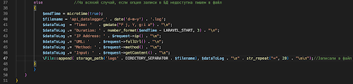

# Продвинутое программирование на PHP — Laravel
## Домашняя работа №8

---

В этой практической работе вы разработаете сервис логирования, который:
— фиксирует обращения к сайту;
— собирает их в базе данных с возможностью отключения системы логирования;
— отражает в реальном времени HTTP-запросы к приложению.

Создадим новый проект:

composer create-project laravel/laravel log-service

### 1. Для начала создадим модель логов. Для создания модели необходимо использовать artisan с параметром make:model.
   В итоге наша команда будет выглядеть так:
php artisan make:model Log

По умолчанию модель создаётся в ./app/Models/Log.php.
Модель создана, для избежания ошибок запросов SQL необходимо отключить автоматические метки времени.

---

---

---

### 2. Теперь опишем миграцию для создания нашей таблицы логов:

php artisan make:migration create_logs_table

Напомним, что таблицы миграции создаются по умолчанию в /database/migration/current_date_time_create_logs_table.php.

По умолчанию создаётся файл, содержимое которого выглядит так:

---

---

В этом файле нам нужно определить поля, которые будет собирать наш сервис логирования:
— time — время события;
— duration — длительность;
— IP — IP-адрес зашедшего пользователя;
— url — адрес, который запросил пользователь;
— method — HTTP-метод (GET, POST);
— input — передаваемые параметры.

В итоге файл должен приобрести такой вид:

---

---

---

### 3. Миграция создана, параметры описаны. Теперь создадим таблицу.

Напоминаем, что таблица создаётся также через artisan c параметром migrate php artisan migrate.

---

---

### 4. База данных подготовлена, теперь нужно создать звено (middleware) для обработки HTTP-запросов. Напоминаем, что звенья создаются при помощи команды php artisan make:middleware название модели.

В нашем случае нам нужна команда:
php artisan make:middleware DataLogger

По умолчанию звено (посредник) создастся по пути ./app/Http/Middleware/DataLogger.php.
Теперь необходимо настроить middleware. Открываем Datalogger.php. Добавим использование созданной модели.

---

---

---

Также нужно завершить создание middleware DataLogger, зарегистрировать его в ./app/Http/Kernel.php.

---

---

---

### 5. Модель создана, посредник HTTP-запросов настроен и зарегистрирован как класс в Kernel.php. Если сейчас запустить Laravel командой php artisan serv, всё будет работать. Логи будут записываться в базу данных.
Но увидеть это можно только в самой базе SQL. Для получения более наглядных результатов необходимо создать в web.php эндпоинт.

---

---

---

Также для этого эндпоинта необходимо создать blade-шаблон: ./resource/view/logs.blade.php

В нём создать запрос к базе SQL и вывод логов в таблицу.

---

---

---

Запускаем приложение, при открытии вашего приложения http://localhost:8000/logs должна открываться таблица с логами обращения к сайту.
---

---
